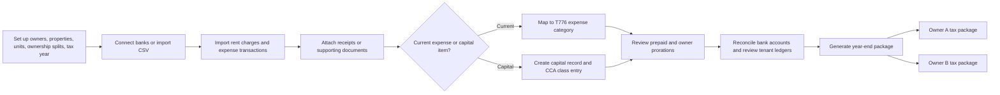
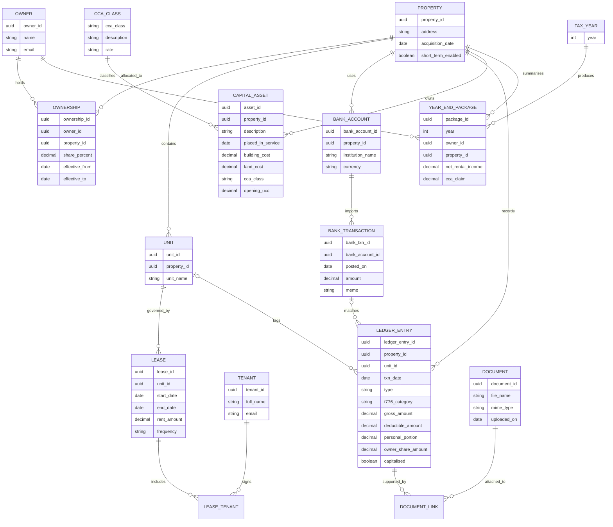

# Building a Tax-Ready Rental Management App for Ontario Co-Owners

## Executive summary

For two individual co-owners in Ontario who hold residential rentals directly, the right product target is not a generic “landlord app”; it is an **accrual-capable, document-backed rental accounting system** that can survive tax season and an audit. The governing return for most ordinary rental activity is **Form T776, Statement of Real Estate Rentals**, filed with the owners' personal returns, and the CRA's co-owner guidance requires each co-owner to report based on ownership share and complete the co-owner details section when applicable. The CRA's rental guide also makes accrual accounting the default in most cases and treats capital items, CCA, and document retention as first-class compliance concerns. citeturn6view3turn6view4turn6view5turn7view2turn6view8turn11view8

The most important product decision is therefore **what to build first**. For this use case, the MVP should prioritise: a property and ownership master; an accrual rent ledger; expense capture mapped to T776 categories; scanned receipt/document storage; bank-feed reconciliation with CSV fallback; a capital improvements and CCA register; mixed-use and multi-owner prorations; and an exportable year-end package for each owner. Tenant portals, online rent collection, e-signatures, maintenance ticketing, OCR, and mobile polish are valuable, but they should come **after** the tax ledger is reliable. That priority follows directly from CRA rules on accrual reporting, capital-versus-current treatment, CCA, and record keeping. citeturn7view2turn11view0turn11view1turn10view0turn10view2turn10view3turn6view8turn38view0

If you were buying rather than building, the strongest Canadian compliance baseline today is **QuickBooks Online Canada plus TurboTax Canada**: QuickBooks brings CRA-oriented GST/HST tracking, bank feeds, reporting, and a mobile app, while TurboTax directly supports T776 and CRA NETFILE. By contrast, the strongest landlord-operational products in the market are mostly **US-tax-first**, especially Stessa and Landlord Studio, whose published tax workflows emphasise IRS **Schedule E**, not CRA T776 or Canadian CCA. Buildium and Rentec Direct are strong workflow benchmarks, but neither surfaces explicit Canadian personal rental tax support in the reviewed product materials. citeturn20search0turn17view1turn23view1turn24view0turn23view3turn35search4turn37search1turn33view2turn32view2turn28search2turn29search2

On privacy and hosting, **PIPEDA does not impose a blanket Canadian-data-residency rule**, but it does impose accountability for third-party processors, comparable safeguards, and mandatory breach reporting where there is a real risk of significant harm. So a Canada-resident hosting option is commercially smart for Ontario landlords, but the legal minimum is stronger governance: privacy ownership, contracts with processors, audit trails, access controls, and breach processes. citeturn13search0turn13search3turn13search6turn13search1turn13search4

## Canadian and Ontario tax requirements

### Core income-tax treatment

The CRA’s rental guide says rental income includes income from houses, apartments, rooms, office space, and other real or movable property, and it explicitly states that the guide is used to complete **Form T776**. The same guide says rental income is generally reported for the **calendar year**, and in most cases it should be calculated using the **accrual method**: income is reported when earned and expenses when incurred, not merely when cash changes hands. The CRA permits the cash method only where the result would be almost the same as accrual, which is not a sound design basis for a tax-ready app. citeturn6view3turn7view2

For co-owners, the CRA says that most jointly owned rental property arrangements are treated as **co-ownership**, not automatically as partnerships. The T776 instructions then say the co-owner should enter their share based on ownership and complete **Part 2 – Details of other co-owners and partners**. For a two-owner Ontario app, that means the data model should treat ownership percentages as effective-dated tax facts, not as a loose reporting preference. citeturn6view5turn6view4turn7view2

The CRA’s deductible rental expense categories are broader than many consumer landlord apps assume. The published T776 guidance covers advertising, insurance, interest and bank charges, office expenses, legal and accounting fees, management and administration fees, repairs and maintenance, salaries/wages/benefits, property taxes, travel, utilities, motor vehicle expenses, and other expenses. A tax-ready product should therefore ship with a **CRA-shaped category model**, not a generic spending-tag system. citeturn8view0turn8view1turn9view0turn9view1turn9view2turn38view2

Several items are **not** ordinary deductions. Mortgage **principal** is not deductible; only qualifying interest is. Land transfer tax paid on acquisition is not deductible and must instead be added to the property’s cost base. Legal fees to **prepare leases** or collect rent are deductible, but legal fees to **buy** the rental property are capitalised and allocated between land and building. citeturn7view4turn9view1turn38view2

### Capitalisation and CCA

The CRA’s distinction between **current expenses** and **capital expenses** is fundamental. Repairs that simply restore operating condition are often current; the cost of replacing a separate asset, improving the property, or renovating an older building acquired to make it rentable is generally capital. This is one of the most important challenge points in rental reviews, and your app should force a deliberate decision between “expense now” and “capitalise”. citeturn11view0turn11view1

CCA is not a free-form depreciation tool. The CRA explains that depreciable rental property—such as buildings, furniture, or equipment—must be claimed through the CCA system over time, while **land is not depreciable**. The rental guides also require tracking by CRA class, opening UCC, additions, dispositions, and in many cases the **half-year rule** for additions in the current year. citeturn6view6turn6view7turn10view2turn10view3

The CRA further states that you **cannot use CCA to create or increase a rental loss**. That rule is load-bearing for product design: the year-end engine must cap the claim automatically and preserve the unused UCC for future years instead of letting users over-claim. citeturn10view0

A serious Ontario-focused app should also support less obvious but common capital/timing rules. One example is mortgage-related financing costs such as application, appraisal, guarantee, brokerage, and legal fees tied to mortgage financing: the CRA says these are generally deducted over **five years**, not immediately in full. Another is mixed-purpose refinancing: the CRA says extra interest is not deductible where refinanced funds are used for personal purposes rather than the rental activity. citeturn8view1turn9view0turn9view1

### GST/HST, short-term rentals, and record keeping

For typical Ontario long-term residential rentals, GST/HST is usually a **non-issue operationally but an issue architecturally**. The CRA’s GST/HST registrant guide says **long-term residential accommodation of one month or more is exempt**, and CRA guidance on exempt supplies says registrants generally **cannot claim input tax credits** for GST/HST paid on expenses acquired to make exempt supplies. For a long-term residential landlord app, GST/HST should therefore be a supported edge case, not the centre of the MVP. citeturn11view4turn12search0turn12search1turn12search9

However, if the product may later serve **short-term accommodation**, the model changes materially. CRA guidance for the platform economy says accommodation for a period of continuous occupancy of **less than one month** is generally taxable for GST/HST purposes, and CRA’s registration guidance says a person generally must register once they exceed the **$30,000** small-supplier threshold in a single calendar quarter or over four consecutive quarters. Separately, for income-tax purposes, the CRA’s 2025 short-term rental guidance defines a short-term rental as a residential property rented or offered for rent for **less than 90 consecutive days**, and denies deductions for the “non-compliant amount” after 2023 where the short-term rental is not permitted or does not meet applicable provincial or municipal registration, licensing, or permit requirements. Those are two different regimes with two different thresholds, and the app should model them separately. citeturn11view5turn11view6turn11view7

Record keeping is not optional. CRA guidance says records and supporting documents generally must be kept for **six years** from the end of the last tax year they relate to. If you file late, the six-year period generally runs from the filing date. Where records concern **long-term acquisitions or disposals of property** or other historical information affecting a sale or wind-up, CRA says they must be kept **indefinitely**. CRA audit guidance also says auditors may examine ledgers, invoices, receipts, contracts, rental records, bank statements, mortgage documents, and electronic records. citeturn6view8turn38view0

Digital records are acceptable, but the format matters. CRA says it accepts paper records later converted to electronic form, or records created electronically, provided they are **accessible and readable**. The agency also says electronically kept records must remain in an **electronically readable and useable format**, and records maintained outside Canada may be acceptable if a readable, useable copy is made available in Canada for CRA officials. This is a strong argument for image/PDF receipt capture, immutable attachments, and exportable year-end archives. citeturn6view9turn11view8

### Common review-risk areas

The CRA does not publish a simple landlord “audit trigger” checklist, but its real-estate compliance pages, audit guidance, and rental rules make the high-risk patterns fairly clear. The strongest review-risk signals are: **unreported or under-reported rental income**; weak books and missing support; deductions that do not reconcile to bank statements or loan documents; current-expense claims for what should be capital improvements; CCA claims that improperly create or increase losses; repeated losses where there may be no genuine source-of-income expectation; and short-term rental deductions taken in circumstances that are not compliant with applicable rules. The CRA also says it uses analytics, leads, and **third-party data** to identify high-risk real-estate files. In this report, I treat these as **review-risk indicators inferred from CRA publications**, not as a formally published CRA trigger list. citeturn6view0turn38view0turn11view0turn11view1turn10view0turn11view7turn6view2

## Product requirements for tax-ready capture

### Bare-minimum features

A bare-minimum tax-ready product for Ontario co-owners should be designed around the CRA return logic above, not around consumer-grade “rent tracking”. In practice, that means a **rental accounting core** with a **property operations shell**, not the reverse. The most important rule-to-feature mappings are below. citeturn7view2turn11view0turn10view2turn6view8

| Area | Must capture | Why it is tax-critical |
|---|---|---|
| Property and ownership master | Property, units, purchase date, municipal address, owners, effective-dated ownership %, short-term flag | CRA requires co-owners to report based on ownership share and complete co-owner details. citeturn6view4turn6view5 |
| Accrual rent ledger | Lease terms, rent schedule, charges, payments, arrears, credits, write-offs, other rental income | CRA says rental income is generally reported on the accrual basis, and bad debts/uncollectible rent can affect gross income. citeturn7view2 |
| T776-shaped expense model | Categories for advertising, insurance, interest/bank charges, office, professional fees, management/admin, repairs, salaries/wages/benefits, property tax, travel, utilities, motor vehicle, other | These are the CRA’s published rental categories; a mismatched chart of accounts creates year-end rework. citeturn8view0turn9view1turn38view2 |
| Receipt and document vault | Image/PDF uploads, source metadata, vendor/date/amount tags, link to transaction, exportable archive | CRA accepts digital records, but they must remain readable, accessible, and support the reported figures. citeturn6view9turn11view8turn38view0 |
| Bank connection and reconciliation | Bank feeds, CSV/QIF fallback, transaction matching, reconciliation status, unmatched exception queue | CRA audit materials explicitly reference bank statements and electronic records; reconciliation is what turns raw feeds into defensible books. citeturn38view0 |
| Loan and financing subledger | Mortgage interest, lender, statement periods, refinancing notes, mortgage set-up/broker/legal/appraisal fees with amortisation schedule | Mortgage principal is not deductible; qualifying interest is, and certain financing costs are deducted over five years. citeturn7view4turn8view1 |
| Capital improvements and CCA register | Asset description, acquisition date, land/building split, CRA class, cost basis, additions, dispositions, proceeds, opening UCC, half-year-rule flag | Capital items, land allocation, class/UCC continuity, and CCA-loss limits are central CRA requirements. citeturn11view0turn10view2turn10view3turn10view0turn6view7 |
| Proration engine | Partial-year availability, owner split, prepaids, vacancy periods, short-term non-compliant portion | CRA requires prepaids to be spread over benefit periods and certain short-term rental deductions to be denied. citeturn11view7 |
| GST/HST flags | Supply type, exempt/taxable flag, taxable-stay indicator, GST/HST amount if applicable, registration status | Long-term residential rent is generally exempt, but short-term accommodation may be taxable and registration may become mandatory above the small-supplier threshold. citeturn11view4turn11view5turn11view6turn12search0 |
| Year-end tax package export | T776-ready summary, owner share worksheet, rent ledger, expense detail, capital/CCA schedule, receipt index, bank rec status, accountant notes | CRA expects figures to be supportable from records, not merely summarised into a single net number. citeturn38view0turn6view8 |

There are also a few **less obvious but high-value** minimum requirements that many first versions miss. The first is **prepaid expense handling**. CRA’s rental guide says prepaid expenses should be deducted in the year or years to which the benefit relates, so the app must be able to split, for example, an annual insurance payment across the appropriate periods instead of expensing it all on the payment date. The second is **capital acquisition cost handling**, including legal fees and land transfer tax that belong in cost basis rather than operating expense. The third is an **effective-dated ownership model**, because a simple “50/50 forever” toggle is not robust enough if ownership changes, one owner funds a capital project separately, or the accountant needs tax-year-specific allocations. citeturn8view1turn9view1turn7view4

### Nice-to-have features

The right nice-to-haves are features that reduce admin time **without becoming tax truth themselves**. Automated categorisation, OCR receipt parsing, smart duplicate detection, e-signatures, online rent collection, a tenant portal, maintenance ticketing, lease management, mobile-first capture, dashboarding, and templated year-end reports all belong here. They are commercially important and now standard in competing products, but they should sit on top of a reviewed ledger and document system, not replace one. citeturn17view1turn35search2turn36search8turn32view1turn26search3turn29search1

Ontario-specific legal support is most relevant in **e-signatures**. Ontario’s Electronic Commerce Act provides that, subject to exceptions, a legal requirement that a document be signed is satisfied by an **electronic signature**. That makes e-signature support a sensible second-wave feature for leases, owner approvals, and consents—provided the workflow preserves signer identity, timestamping, and document integrity. citeturn14search3

An HST/GST calculator is useful, but only if the app may extend into **taxable** rental activity, especially short-term accommodation. A mileage tracker is similarly optional: the CRA allows rental motor-vehicle deductions only in specific circumstances, so it is worth shipping later unless your intended users routinely claim them. citeturn11view5turn11view6turn38view2

## Competitive landscape

The table below compares six products that are relevant benchmarks for a Canadian landlord-focused build. Pricing is shown **as published on reviewed product pages on 27 May 2026** and can change. For the non-Canadian vendors, the product pages reviewed were not Canada-specific.

| Product | Published pricing | Best fit | Canadian tax fit | Bank, mobile, export | Sources |
|---|---|---|---|---|---|
| **QuickBooks Online Canada** | EasyStart **C$30/mo**; Plus **C$110/mo**; Advanced **C$220/mo** | Best off-the-shelf bookkeeping baseline | **Strong for Canadian bookkeeping**: CRA GST/HST tracking, reports, bank feeds. But it is still accounting software, not a landlord-specific T776 workflow. | Automated bank feeds; free mobile app; report export; Excel sync; receipt capture | citeturn20search0turn17view0turn17view1turn19view0 |
| **TurboTax Canada** | Online Self-Employed **C$70/return** for rental income; Desktop Premier **C$100** | Best filing layer, not operations layer | **Strongest direct tax-filing fit** in this comparison: T776 included, CRA NETFILE certified | Mobile app; document upload/My Docs; forms mode in download products; output is the filed return/forms, not a property ledger | citeturn23view1turn22search1turn24view0turn23view2turn23view3 |
| **Buildium** | Essential **$62/mo**; Growth **$192/mo**; Premium **$400/mo** | Best heavy-duty operations benchmark | **Generic for Canada** in reviewed materials: strong accounting, portals, maintenance, leasing; no explicit CRA/T776 support surfaced | Bank feed; property manager/resident apps; PDF/XLSX/CSV exports; owner and resident portals | citeturn28search2turn27search2turn26search3turn26search4turn27search3turn27search0 |
| **Rentec Direct** | Rentec Pro **$45/mo**; Rentec PM **$55/mo**; pricing scales by unit count | Best export-and-ledger benchmark for smaller portfolios | **Generic/US-oriented** in reviewed materials: strong accounting/export, but no explicit CRA/T776 support surfaced | Bank transaction syncing; landlord, tenant, and owner mobile apps; PDF/Excel/CSV and QuickBooks-compatible export | citeturn29search2turn29search4turn29search1turn30search6turn30search12turn30search0 |
| **Stessa** | Essentials **Free**; Manage **$15/mo monthly** or **$12/mo annual**; Pro **$35/mo monthly** or **$28/mo annual** | Best reporting/dashboard benchmark | **Weak for Canadian tax**: tax model is explicitly built around IRS Schedule E rather than CRA T776/CCA | Automatic bank feeds; mobile app with receipt scanning; Excel/PDF report export; rent collection; maintenance | citeturn35search4turn35search2turn36search1turn36search2turn36search7turn37search1turn37search10 |
| **Landlord Studio** | Go **Free** for 1–3 units; Pro **$12/mo**; Pro Plus **$28/mo** | Best small-landlord UX benchmark | **Mixed for Canada**: bank feeds are available in Canada, but published tax reports are Schedule E-oriented, not T776/CCA-oriented | Bank feeds in USA/UK/Canada via Plaid; mobile app; tenant app; CSV/PDF export; receipt scanning; rent collection | citeturn33view2turn32view3turn32view2turn34search2turn34search1 |

Analytically, these six products cluster into three groups. **TurboTax** is a tax-filing endpoint, not a management system. **QuickBooks Canada** is the best Canadian bookkeeping baseline, but lacks the landlord-native workflow and tax abstractions you would want in a purpose-built product. **Buildium, Rentec Direct, Stessa, and Landlord Studio** are better operational references, but their published tax workflows are mostly **US-first**, meaning you would still need a Canadian rental tax layer on top. citeturn23view1turn24view0turn17view1turn35search4turn37search1turn32view2turn28search2turn29search2

If your goal is to build the best Ontario-focused app rather than simply clone an existing one, the most useful competitive synthesis is this: use **QuickBooks Canada** as the benchmark for bank feeds, reporting, and accountant handoff; **Landlord Studio** as the benchmark for small-landlord UX and mobile capture; **Buildium** as the benchmark for lease/maintenance/owner portal depth; **Rentec** as the benchmark for export flexibility; and **Stessa** as the benchmark for property-specific reporting dashboards—while replacing all US-tax assumptions with a **CRA-native T776/CCA/ownership model**. citeturn17view1turn32view1turn28search2turn30search12turn35search2

## Data model and workflow

### Minimal workflow

The right minimal workflow is a **review-first close process**. The user should not jump straight from bank feed to tax package. Instead, the workflow should force deliberate review of ownership, categorisation, receipts, capitalisation, and reconciliations before year-end numbers are frozen. That mirrors the CRA’s emphasis on accrual, supportable deductions, and records that can actually be examined in an audit. citeturn7view2turn38view0turn11view0turn10view0



The minimal UI can therefore be kept to five primary screens without making the product simplistic:

| Screen | Purpose | Why it matters |
|---|---|---|
| **Portfolio setup** | Capture property, unit, loan, and owner facts | Prevents “spreadsheet assumptions” around ownership and cost basis |
| **Transactions inbox** | Review imported/manual transactions, match bank items, tag category | Keeps categorisation and reconciliation in one audit trail |
| **Documents** | Upload receipts, invoices, mortgage statements, tax bills, insurance documents | Makes CRA support documents retrievable and exportable |
| **Capital register** | Distinguish repairs from improvements; manage land/building split and CCA | Reduces the most common classification errors |
| **Year-end package** | Freeze numbers, generate owner-share exports, expose exceptions | Produces accountant-ready output instead of just dashboards |

### Suggested data model



The key architectural choice here is that **ledger entries and capital assets are different objects**. A rushed MVP often stores both in one transaction table, which makes repairs-versus-improvements, CCA continuity, and owner-share reporting much harder to defend later.

### Sample year-end package layout

The year-end export should look less like a dashboard and more like a compact accountant file:

```text
YEAR-END RENTAL TAX PACKAGE
Tax year: 2026
Owner: Alex Owner
Ownership share: 50.00%
Property: 123 Example Street, Toronto, ON

A. Portfolio summary
- Gross rent charged
- Rent collected
- Other income
- Uncollectible rent write-offs
- Net rental income before CCA
- CCA claimed
- Net rental income after CCA

B. T776-ready income and expense summary
- Gross rents
- Other income
- Advertising
- Insurance
- Interest and bank charges
- Office expenses
- Professional fees
- Management and administration fees
- Repairs and maintenance
- Salaries, wages, benefits
- Property taxes
- Travel
- Utilities
- Motor vehicle expenses
- Other expenses
- Owner share adjustments

C. Capital and CCA schedule
- Opening UCC by class
- Additions in year
- Dispositions in year
- Half-year-rule adjustment
- CCA claim
- Closing UCC
- Land additions / dispositions

D. Rent ledger summary
- Unit
- Tenant
- Monthly rent
- Charges
- Payments
- Credits
- Balance outstanding

E. Reconciliation status
- Bank account
- Statement ending date
- Reconciled through
- Unmatched items count

F. Source document index
- Document ID
- Type
- Date
- Vendor / issuer
- Linked transaction or asset
- Notes

G. Owner-only worksheet
- Property total
- Ownership %
- Owner allocable share
- Manual overrides / accountant notes
```

That final **owner-only worksheet** matters because the co-owned property should still remain auditable at the full-property level, while each owner needs their own tax-package output based on the applicable ownership share. citeturn6view4turn6view5turn8view1

## Security and privacy

PIPEDA is directly relevant here because the Office of the Privacy Commissioner says landlords handling tenant personal information in the course of commercial activity are subject to the federal private-sector privacy regime, unless substantially similar provincial legislation applies. PIPEDA’s fair information principles also make the organisation accountable for personal information it holds and for personal information transferred to third parties for processing. For a rental app, that means tenant identity/contact data, lease documents, bank-linked transaction metadata, maintenance communications, and owner financial records all sit inside the privacy boundary. citeturn13search2turn13search3turn13search11

Canadian data residency is therefore best understood as a **design choice with compliance implications**, not as a blanket statutory requirement. The OPC’s cross-border guidance says PIPEDA does **not prohibit** transfers to another jurisdiction for processing, but the Canadian organisation remains accountable and must use contractual or other means to ensure a comparable level of protection. Separately, CRA electronic-record guidance says records kept outside Canada may still be acceptable if readable, useable copies can be made available in Canada. For a commercial product sold to Ontario landlords, a Canada-hosted option is still highly desirable because it simplifies procurement, reduces residency objections, and pairs well with CRA record-access expectations. citeturn13search0turn13search6turn13search12turn11view8

Breach handling is not optional either. The OPC states that organisations subject to PIPEDA must report breaches of security safeguards that pose a **real risk of significant harm**, notify affected individuals, and keep records of **all** breaches. That has direct product implications: audit logs, incident logging, security-event retention, and customer-visible breach workflows should be part of the platform plan, not an afterthought. citeturn13search1turn13search4

Ontario-specific legal support matters in document execution. Under Ontario’s Electronic Commerce Act, a legal requirement for a signature is generally satisfied by an **electronic signature**, subject to statutory exclusions. So e-signature support is legally plausible for many lease and owner-approval workflows, but the product should preserve the full signature evidence trail—document hash, signer identity, timestamp, IP/device data if available, and the final signed artefact. citeturn14search3

If the app directly stores, processes, or transmits payment-card data for rent collection, PCI DSS becomes relevant. The PCI Security Standards Council describes PCI DSS as a baseline of technical and operational requirements for entities that store, process, transmit, or could impact the security of payment account data. The cleanest implementation is therefore to **minimise scope** by leaning on hosted payment processors and avoiding direct card-data handling wherever possible. citeturn15search5turn15search8

From a product-design standpoint, the practical compliance posture should be: strict role-based access for the two owners and any accountant; MFA by default; immutable document/version history; granular permissions around banking, tax packages, and leases; tenant-data minimisation; exportable audit logs; and configurable data-retention policies that respect both tax-record retention and privacy deletion workflows. Those controls are not just “enterprise extras” here—they are what make a two-owner app trustworthy in real use. citeturn13search3turn13search6turn13search11

## MVP roadmap

The roadmap should follow the **tax risk curve**, not the feature-marketing curve. In other words: implement the data structures that stop the expensive mistakes first, then add the features tenants will notice. That sequencing follows directly from CRA emphasis on accrual reporting, records, capitalisation, and owner-share support. citeturn7view2turn11view0turn10view0turn6view8

| Release slice | Scope | Effort | Why now |
|---|---|---|---|
| **Foundation** | Property/unit model, owner records, effective-dated ownership shares, CRA-shaped expense categories, document storage, manual transaction entry, basic rent ledger | **Low–Medium** | Without this, every later feature sits on weak data |
| **Accounting core** | Bank feeds, CSV import, reconciliation queue, transaction review, receipt attachment, arrears view, year-end close status | **Medium** | This creates the audit trail and removes spreadsheet dependency |
| **Tax hardening** | Capital-vs-current workflow, land/building split, financing-fee amortisation, CCA engine, owner prorations, T776-ready exports | **High** | This is the hardest logic and the main source of accountant clean-up if omitted |
| **Collaboration** | Accountant access, owner approvals for capex, exception notes, package sharing, formal close/freeze process | **Medium** | Important for two-owner governance and year-end confidence |
| **Operational convenience** | Tenant portal, rent collection, e-signatures, maintenance tickets, OCR, automated categorisation, mobile polish, dashboards | **Medium–High** | Valuable commercially, but safer once the tax ledger is stable |

If you need a sharper “what is in MVP versus not in MVP” line, I would draw it here: **MVP includes everything needed to produce a defendable year-end package; MVP does not need to include everything needed to run a polished resident experience**. That means rent ledgers are in; tenant chat can wait. CCA is in; maintenance marketplaces can wait. Receipt images are in; OCR confidence scoring can wait. E-signatures can wait unless leases are a first-release commercial requirement. citeturn7view2turn10view0turn6view8turn14search3

The single most important product recommendation is to treat **T776 mapping, ownership allocation, and CCA continuity** as core domain objects from day one. If you build those in late, you will end up retrofitting the hardest tax logic after users already have bad or incomplete data. If you build them in first, nearly all later landlord features become easier to add without breaking tax-season readiness. citeturn6view4turn10view2turn10view3turn38view0
